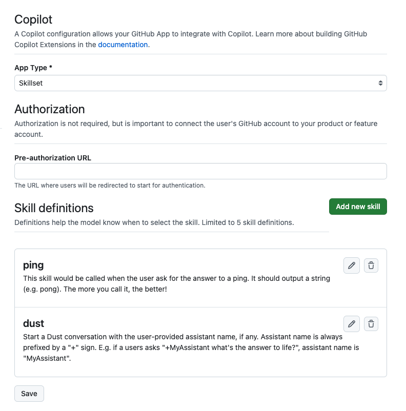

# GitHub Copilot Extension for Dust

> [!WARNING]
> This is a work in progress and not yet ready for use. Documentation and code may be incomplete or incorrect.

This is a GitHub Copilot extension that allows you to send messages to the Dust assistant.
You will need to have an active Dust subscription to use this extension.

> [!NOTE]
> This extension is a "skillset". Refer to the [GitHub Copilot documentation](https://docs.github.com/en/copilot/building-copilot-extensions/building-a-copilot-skillset-for-your-copilot-extension/about-copilot-skillsets) for more information.

## Usage

Setup up your application: https://docs.github.com/en/copilot/building-copilot-extensions/setting-up-copilot-extensions

You'll need at least 2 skills, as in the screenshot below:



Here is an example of the `dust` skill parameters, that should map to the `/skills/dust` endpoint.

```json
{
  "type": "object",
  "properties": {
    "assistant": {
      "type": "string",
      "description": "Name of the assistant to talk to."
    },
    "message": {
      "type": "string",
      "description": "The message to send to Dust",
      "required": "true"
    }
  }
}
```

Copy and adjust the `.env` file:

```sh
cp .env .env.local
```

Run the server:

```sh
pnpm run dev
```

Optionally expose the server to the internet using e.g. `ngrok` to test it live from GitHub Copilot:

```sh
ngrok http 3000
```

## Deployment

### Using Docker

A docker image is available on GitHub Container Registry at `ghcr.io/djiit/github-copilot-dust`.

You can run it with the following command:

```sh
docker run \
  -p 3000:3000 \
  -e DUST_WORKSPACE_ID=<your-workspace-id> \
  -e DUST_API_KEY=<your-api-key> \
  ghcr.io/djiit/github-copilot-dust:main
```
